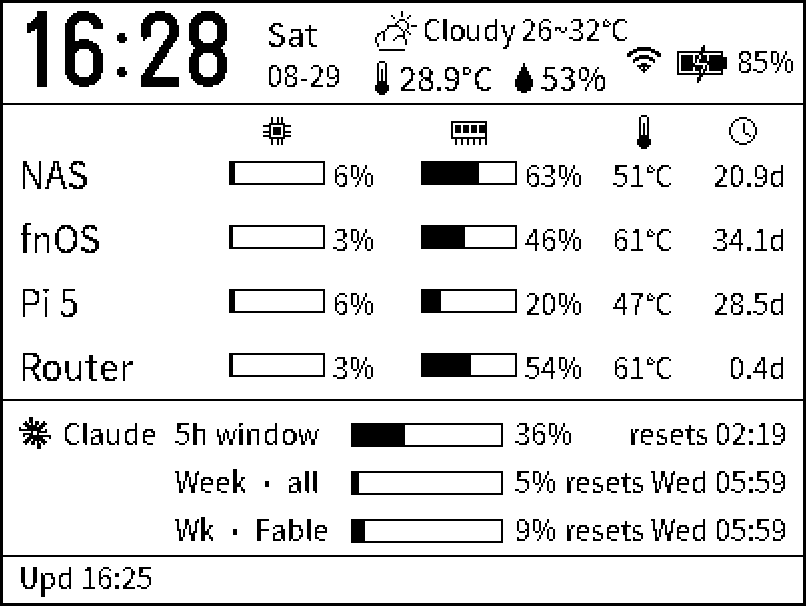
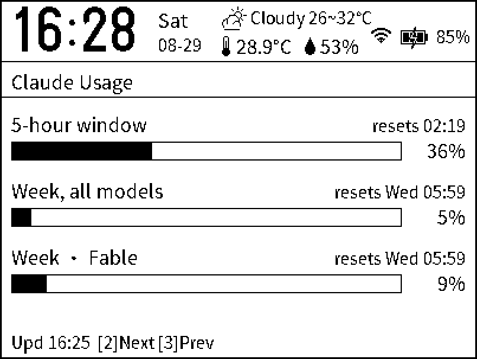
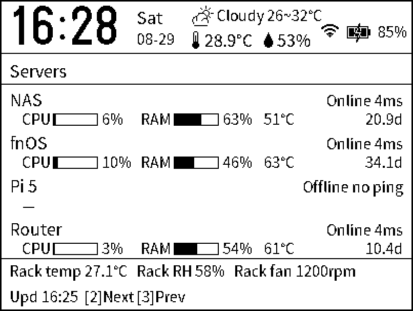
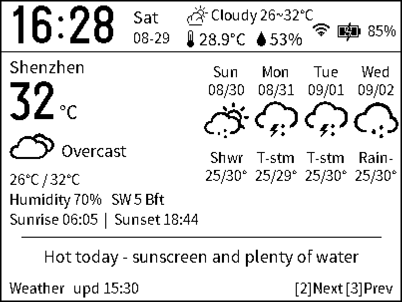
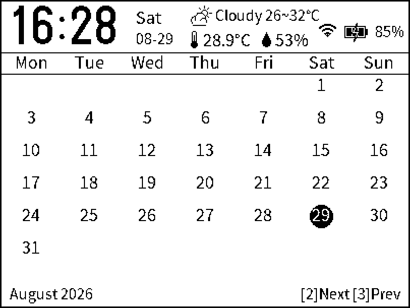
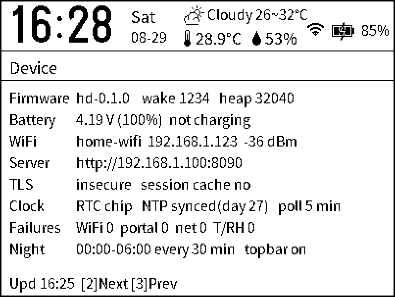

# eink-dashboard — an ESP8266 e-paper homelab dashboard

**English** | [中文](README.zh-CN.md)

A 4.2" Z96 e-paper panel driven by an ESP8266. The hardware is the 4.2" revB-230621 board (HINK-E04A13-A0 / Z96 panel)
from [Lichengjiez/weather-ink-screen](https://gitee.com/Lichengjiez/weather-ink-screen).
This repo is a standalone firmware rewritten for that board: it turns the panel into a status dashboard for a home lab
(NAS / Raspberry Pi / router), keeps the original firmware's clock, temperature/humidity and battery readouts, and adds
a perpetual calendar page and a weather page. The panel driver, RTC chip, humidity sensor and battery sensing logic are
ported from the original firmware — no hardware changes. Design notes are in [DESIGN.md](DESIGN.md); the 3D-printable enclosure is in `stl/` (see [Files](#files)).

<p align="center">

</p>

The finished device in its printed enclosure, showing the dashboard page (Chinese UI).

<p>






</p>

Left to right, top to bottom: dashboard, Claude usage, server details, weather, calendar, device info.

The top bar (clock / SHT30 temperature and humidity / current-weather glyph / WiFi / battery) is drawn from local data and
partial-refreshed every minute; the content area comes from the server's JSON and is only redrawn when it changes.
(The shots above are layout previews rendered by the `preview/` scripts with `--en` — the coordinates match the firmware one to
one. Server names, Claude window labels and the weather advisory come from the server and are shown as it sends them, which is
why they stay Chinese here. The Chinese UI is in [README.zh-CN.md](README.zh-CN.md).)


- **Pages** (SW2 / SW3 page through them during the interactive window): dashboard → Claude usage → server details → weather → calendar → device info
  - Calendar: the Chinese lunar date, the 24 solar terms and the holidays are all looked up on the device (2019–2100, diffed
    day by day against lunar_python with zero mismatches) — no network needed
  - Weather: current conditions + a 4-day forecast + sunrise/sunset + an advisory line, with the original firmware's icon bitmaps.
    The data is pushed by the server; by default Open-Meteo (no API key) located from the public IP, but you can pin a city
    manually or switch to Seniverse
- **Data source**: the shared backend in `server/` — a git submodule of
  [dashboard-backend](https://github.com/jackwuwei/dashboard-backend), the same service that drives the Kindle dashboard
  (Docker, on the NAS). It serves `GET /api/eink.json` over HTTP or HTTPS (BearSSL, built-in root CA or fingerprint pinning),
  with automatic login to upstream captive portals
- **Power**: deep sleep aligned to whole minutes; only the top bar is refreshed each minute; the network is used every N minutes
  (5 by default, 30 at night); ghosting is cleared once an hour on the hour; runs off a 660 mAh cell
- **Setup**: hold SW3 and reset to bring up the `ESP8266 E-Paper` hotspot — the config page pops up on your phone (captive portal)
- **No hardware changes**: the panel driver, RTC chip, humidity and battery logic are all ported from the original firmware, and a
  full flash image of the original weather firmware is kept in `backup/` so you can go back at any time

## Build and flash

```bash
# Prerequisites: arduino-cli + esp8266 core 3.1.2; libraries in ~/arduino-user/libraries
#   GxEPD2, Adafruit GFX/BusIO, U8g2_for_Adafruit_GFX (patched to keep fonts in flash),
#   ArduinoJson 7, ESP_EEPROM, ClosedCube SHT31D (patched for a missing return), BL8025_RTC (zip in the upstream repo)
arduino-cli compile --fqbn esp8266:esp8266:generic:eesz=4M2M,xtal=80,ssl=all,led=2 --warnings none --output-dir build .
uvx --from esptool esptool.py --port /dev/cu.usbserial-2110 --baud 115200 write_flash --flash_mode dio --flash_size 4MB 0x0 build/eink-dashboard.ino.bin
```

Serial log at 115200 (TX only — RX is GPIO3, which is key 3).

**Rolling back to the original weather firmware**: `backup/flash_full_4MB_*.bin` is a full 4 MB dump taken before flashing;
`esptool.py --baud 115200 write_flash 0x0 backup/flash_full_4MB_….bin` restores it as it was.

## First-time setup

1. The first power-up goes straight into setup mode. To get back into it later: hold **SW3**, tap **SW1**, and keep holding SW3 for another 2 seconds. The screen shows the hotspot details
2. Join the `ESP8266 E-Paper` hotspot from your phone (password `333333333`). The config page should pop up; if it doesn't, open http://192.168.3.3
3. Fill in the WiFi and the server URL (`http://192.168.1.100:8090` or `https://…:8443`), tap **Test connection**, and once it says `ok`, **Save & connect**
4. Five seconds after it connects, the device reboots into the dashboard

The config page also covers: display language (中文 / English), HTTPS certificate checking, poll interval, night hours,
captive-portal auto-login, battery readout, screen rotation, and factory reset.

## Language (中文 / English)

The "语言 / Language" selector at the top of the config page sets the language of **both the config page itself and the screen**,
and takes effect as soon as you save (stored in EEPROM as `cfg.lang`).

- Every string the firmware owns has both versions: the top-bar weekday, the status line, every detail page's title and fields,
  the calendar header, the weather page, the setup screen and the low-battery notice
- In English the calendar drops the lunar row, weather conditions are named locally from the Seniverse weather code (the four
  forecast columns use a shorter set — each column is only 50 px wide), and wind reads `西南风` → `SW`, `5级` → `5 Bft`
- **Anything the server sends is left alone**: server names, Claude window labels, rack sensor rows, the weather advisory and the
  city name are shown as they arrive (change the server's `config.yaml` if you want those in English)
- The string table lives in `I18N_STRINGS` in `i18n.h`, one line per string (`ID, Chinese, English`) — that is the only place to
  edit. The text itself sits in PROGMEM and `TR()` copies it into a rotating buffer, so a single expression can use at most
  6 `TR()` calls (the format string counts as one)

## Corporate / hotel WiFi (captive portals)

For an upstream network that connects but then wants a username and password in a web page, expand
"This WiFi needs a captive-portal login" on the config page:

1. Leave the WiFi password empty (guest networks are usually open), tick **Log in to the portal automatically**, and fill in the portal's username and password
2. The login URL, field names and extra parameters usually need no changes: the device reads them off the redirect it gets when
   it is intercepted. The Aruba controller portal (form POST to `/auth/index.html/u`, fields `user` / `password`, hidden
   `cmd=authenticate` — the setup behind a lot of corporate guest WiFi) is built in as a preset
3. Other portals: look at the login form's `action` and the `name` of each `input`. The login URL can be a full address or just a
   path starting with `/` (it is joined onto the host of the redirect); field names go in as `userField,passwordField`; hidden
   fields go into the extra parameters, e.g. `cmd=authenticate`
4. Tap **Test connection**: `ok` means both the portal login and the fetch went through. For `portal-login-fail`, read the reason
   after it — `portal: Authentication failed` simply means the credentials are wrong

Notes:

- The server URL has to be reachable *from that network*: a corporate network cannot see `192.168.1.x` at home, so use a public
  domain or a tunnel
- Portals normally only hijack ports 80/443, so a direct connection to another port just times out and HTTPS only gives a
  certificate error. When the main request fails, the firmware probes `http://connect.rom.miui.com/generate_204` once to confirm
  it is being intercepted; normal polling sends no extra requests
- Portals allow a MAC through for hours or days, and the device logs back in when that expires. After 3 consecutive login
  failures the interval backs off to 15 minutes so the account does not get locked
- The ESP8266 is 2.4 GHz only, and it supports neither WPA2-Enterprise (802.1X) nor portals that need JavaScript or a CAPTCHA

## Keys

| Action | Effect |
|---|---|
| SW1 (reset) | Refresh now (fetch + a full black/white flash to clear ghosting + redraw), then a 20 s interactive window with `[2]Next [3]Prev` in the status line |
| Hold SW3 + SW1 | Setup mode: **hold SW3 → tap SW1 and release it → keep SW3 down for another 2 s** (keys are read 0.3 s after boot) |
| SW2 short press | Next page: dashboard → Claude → servers → weather → calendar → device → dashboard |
| SW3 short press | Previous page |
| SW2 long press | Toggle the battery readout (percent / volts) |
| SW3 long press | Fetch from the server right now |

- Each press extends the interactive window by 20 s. Presses are remembered for the whole time the device is awake (during a
  fetch or a refresh) and act as soon as the redraw finishes; after 20 s idle it returns to the dashboard and sleeps
- The small side key next to the USB port is wired in parallel with SW2. Only SW1 wakes the device from deep sleep
- Holding SW2 (GPIO0) across a reset drops the chip into ROM download mode, which is why there is no "SW2 + reset" combination

## Server

The backend lives in `server/`, a git submodule of [dashboard-backend](https://github.com/jackwuwei/dashboard-backend)
shared with the Kindle dashboard. It serves this device from `GET /api/eink.json` (`server/app/eink.py`), configured by the
`eink:` section of `config.yaml`. To deploy:

```bash
git submodule update --init          # first checkout only
cd server
cp .env.example .env                 # HA_TOKEN, if you use Home Assistant
cp config.example.yaml config.yaml   # your servers, HA entities, eink: section
docker compose up -d --build         # HTTP on 8090
```

The voltage and temperature/humidity the device reports back can be read from `GET /api/eink/device`.

## Calendar and weather pages

- **Calendar**: this month, with a second line per cell showing holiday > solar term > lunar date (the month name on the 1st);
  today is inverted. The lunar dates and solar terms are looked up entirely on the device (`lunar.cpp` + `lunar_tab.h`; the table
  is generated by `preview/gen_lunar.py` from lunar_python and covers 2019–2100, and `preview/test_lunar.cpp` diffs it day by day
  with zero mismatches). No network needed.
- **Weather**: pushed by the server in the `w` field of `/api/eink.json` (`server/app/weather.py`); the device picks an icon from
  the Seniverse weather code (the icons are the original weather firmware's 45×45 bitmaps in `weather_icons.h`). The default is
  **Open-Meteo (no key) located from the server's public IP** (`myip.ipip.net` for the city → Open-Meteo geocoding for the
  coordinates, falling back to ip-api.com). `eink.weather` in `config.yaml` can pin `city`/`lat`/`lon` or switch to Seniverse
  (`provider: seniverse` + `key`); `weather: false` turns it off. The server refetches every 30 minutes and serves the cache in between.
- A city name can be any Chinese characters, so the 16 px font additionally carries the names of every prefecture-level city
  (`preview/charset_city.txt`, 16 px only).

A typical deployment, with the server on a NAS at `192.168.1.100`: HTTP on `http://192.168.1.100:8090`.
Every address in this README is an example — substitute your own.
The backend speaks plain HTTP; for HTTPS put any reverse proxy in front of it. The firmware then verifies either with the
built-in root CA (`ca_certs.h` carries ISRG Root X1, i.e. a Let's Encrypt certificate on a public domain) or with a pinned
fingerprint, which is what a self-signed certificate needs:
`echo | openssl s_client -connect 192.168.1.100:8443 2>/dev/null | openssl x509 -noout -fingerprint -sha1`.
To switch: hold SW3 and reset into setup → change the server URL to the `https://…` one → pick the certificate check → test → save.

## Layout and fonts

- `preview/mock.py` (PIL) is the source of truth for the layout: render coordinate changes locally first, then port them to
  `ui.cpp` (the coordinates match one to one). `cd preview && uvx --with pillow python mock.py out.png`
- The previews draw with the firmware's own u8g2 bitmap fonts (`preview/u8g2font.py` decodes them straight out of `fonts_noto.c`
  and U8g2's `u8g2_fonts.c`), so what you see is pixel-identical to the panel, text widths included. It looks for
  `u8g2_fonts.c` in `~/arduino-user/libraries/U8g2_for_Adafruit_GFX/src/`; point `U8G2_FONTS_C` at it if yours is elsewhere.
  A blank where a character should be means the glyph is missing from the charset — regenerate the fonts (below).
- All three preview scripts take `--en` to draw the English UI (English runs wider than Chinese — use it to check nothing collides
  after a wording change): `uvx --with pillow python preview/mock.py --en`
- Fonts: Noto Sans CJK SC converted to u8g2 bitmaps at 14 / 16 / 18 px (`fonts_noto.c`; the character set in
  `preview/charset.txt` is collected automatically by `preview/gen_charset.py` from the sources plus the server's
  weather.py/config.yaml). The clock uses u8g2's own `logisoso38_tn`. When a new character shows up in the sources or in a server
  name: `cd preview && python3 gen_charset.py && cd .. && BDFCONV=~/.local/bin/bdfconv zsh preview/gen_fonts.sh`
  (build `bdfconv` from `tools/font/bdfconv` in the u8g2 repo, changing `-O4` to `-O2` in its Makefile).
- Calendar and weather previews: `cd preview && uvx --with pillow --with lunar_python python mock_cal_weather.py [--en]`
- To measure the real pixel width of a string: `cd preview && uvx --with pillow python -c "from u8g2font import fonts; print(fonts()[14].width('Wk · Fable'))"`

## Gotchas

- **It has to be built with `ssl=all`**: the BearSSL in `ssl=basic` only has RSA key exchange, no ECDHE, so any modern server
  (corporate portals, anything on the public internet) answers with handshake_failure (`ssl 40` in the log). It costs ~60 KB of
  flash, which does not matter here.
- **Finding out why WiFi really failed**: build with `--build-property "compiler.cpp.extra_flags=-DWIFI_SDK_DEBUG"` to turn on the
  SDK's state machine log. `state: 2 -> 3 (0)` means authentication passed; `state: 3 -> 0 (12)` means the AP refused the
  association, and the number in parentheses is the 802.11 status code (in hex): 0x12=18 basic rate set not satisfied (the SSID
  only takes 11ax / two-stream clients — nothing the ESP8266 can do), 0x1f=31 requires 802.11w, 0x11=17 too many clients.
  `reason=203` only tells you "association failed" and hides all of this.
- **An open network must not carry a password**: the ESP8266 core's `begin()` sets authmode to WPA as soon as the password is
  non-empty, which filters out open guest networks — they scan fine but come back as reason 201 no-ap. When a connection fails
  the firmware scans once, and if the target is open it reconnects without a password and stores the empty one; picking an open
  network on the config page also clears the password field.
- **Key 2 (GPIO0) shares a pin with the panel's DC line**: once the panel is initialised GPIO0 is an output, so `digitalRead`
  always returns high. `keys.cpp` flips it back to an input to read the key and restores it to output-high afterwards (only while
  the panel is not being clocked, same as the original firmware).
- **The refresh sequence has to match the original firmware**: `display.init(0,0,10,0)` plus partial refreshes only. After a real
  full refresh via `init(0,1)`, partial refreshes in the same power cycle never reach the panel. So a "full refresh" here means
  painting the screen black and then white (the original firmware's `BW_refresh`).

- **The ESP8266 ADC reads ~0.3 V high on wake-ups with RF off** (the reference depends on RF calibration): voltage is only sampled
  on wake-ups with RF on (the polling ones), and the per-minute wake-ups reuse the cached value. Charge detection uses only those samples.
- **There is no hardware charging signal** (GPIO3 floats high with its pull-up once power is cut — tried, does not work): measured
  4.34–4.35 V while charging and 4.28 V unplugged, so the thresholds are ≥4.32 charging / <4.29 not, and a rising trend covers the
  case where the cell is not yet full.

- **WiFi association succeeds, then reason 8 kicks you off**: this is what an ASUS WiFi 6/7 router plus the ESP8266's default
  802.11n mode does. The firmware forces `WIFI_PHY_MODE_11G` before connecting. The original firmware got away with it because the
  SDK had persisted that mode in flash — which a full-chip write wipes.
- **U8g2 keeps its fonts in DRAM**: the stock library does not move them into flash on the ESP8266, so the link blows past RAM.
  `~/arduino-user/libraries/U8g2_for_Adafruit_GFX` carries the same patch as `U8g2_for_Adafruit_GFX20211226.7z` in the upstream
  repo (fonts into `.text.*` sections plus 32-bit aligned reads).

## Files

| File | Contents |
|---|---|
| `eink-dashboard.ino` | The whole wake-up cycle (deep sleep as soon as setup() returns) |
| `config.h` | Pins, thresholds, compile-time constants |
| `settings.*` | EEPROM settings |
| `rtc_mem.*` | State kept across deep sleep (including the TLS session cache) |
| `clock.*` | RTC chip detection/read/write, NTP, software clock |
| `sensors.*` | SHT30, voltage, percentage, charge detection |
| `net.*` / `ca_certs.h` | Fast WiFi reconnect, HTTP/HTTPS, portal login |
| `model.*` | JSON model + LittleFS cache |
| `ui.*` | Drawing and partial/full refresh (including the calendar and weather pages) |
| `i18n.*` | The Chinese/English string table (PROGMEM) and English weekday, month, weather-code and wind names |
| `lunar.*` / `lunar_tab.h` | Lunar date, solar term and holiday tables |
| `weather_icons.h` | Weather icon bitmaps (from the original firmware) |
| `keys.*` | Keys |
| `portal.*` / `portal_html.h` | Setup AP + captive portal |
| `GxEPD2_420_Z96.*` | Panel driver (as-is, apart from the includes and two static members newer GxEPD2 needs) |
| `stl/enclosure-4.2.stl` | 3D-printable enclosure for the 4.2" board, as in the photo above |
| `server/` | The backend, a git submodule → [dashboard-backend](https://github.com/jackwuwei/dashboard-backend) (shared with the Kindle dashboard) |

## License

The upstream project's content is under its [LICENSE](LICENSE) (GPLv3), and since this firmware ports its driver and peripheral
logic, the same applies — please do not sell it commercially.
The fonts are converted from Noto Sans CJK (OFL) and the weather icons come from the upstream project.
