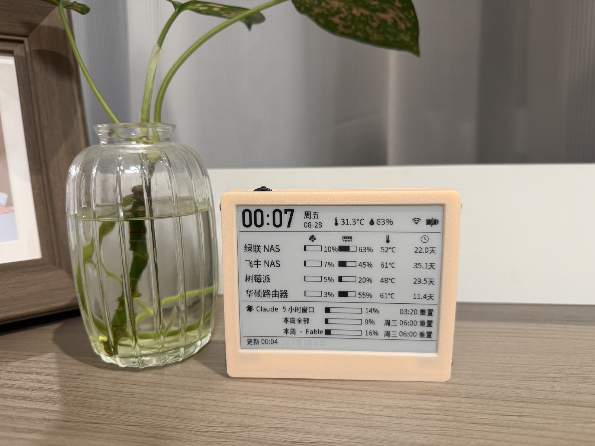
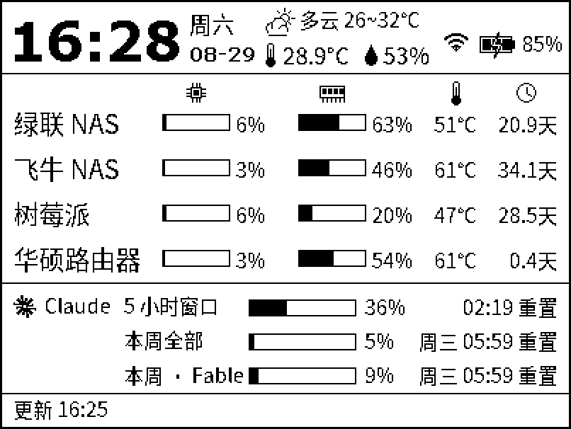
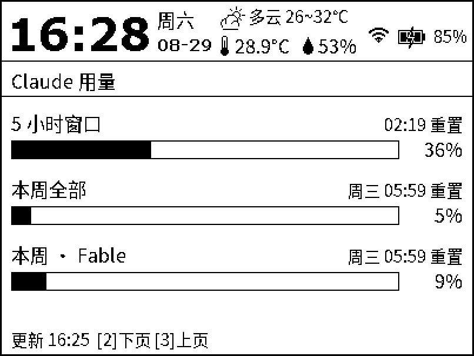
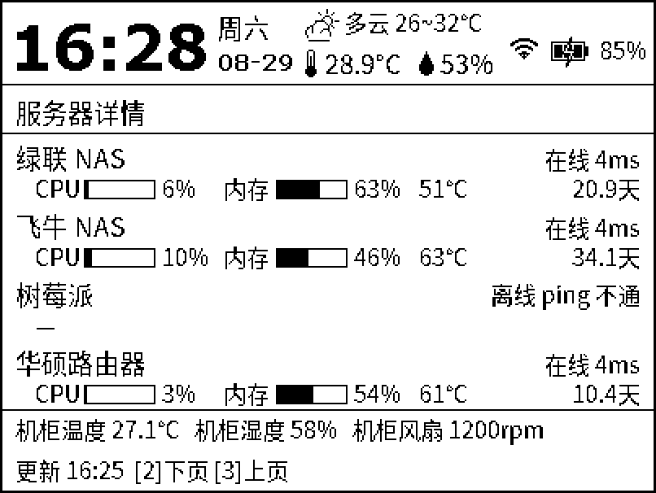
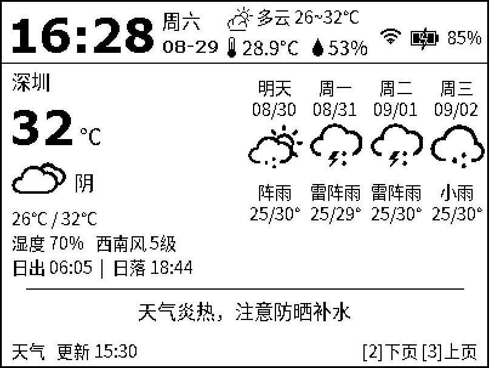
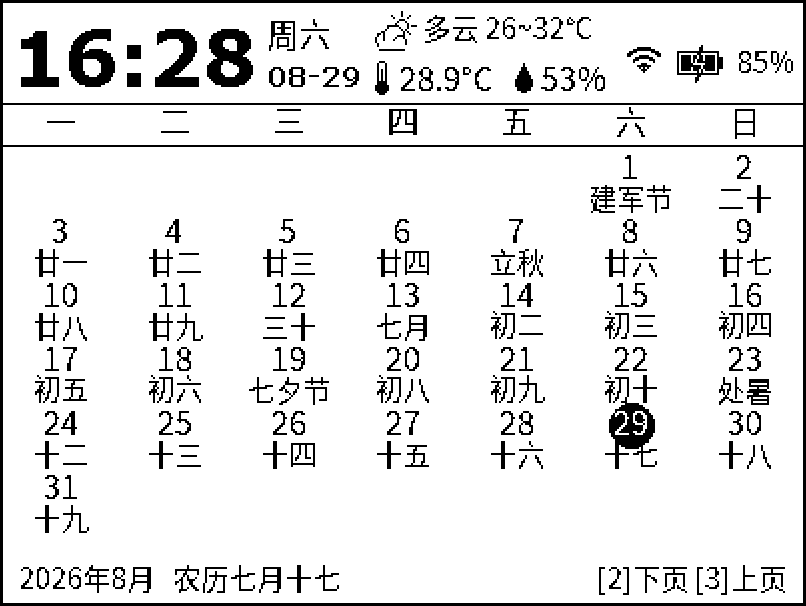
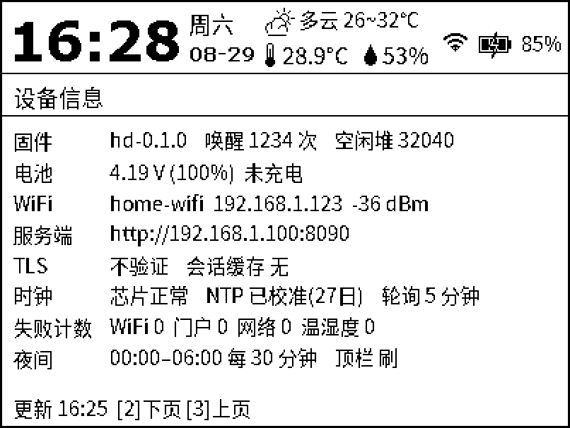

# eink-dashboard — ESP8266 墨水屏 Homelab 看板

[English](README.md) | **中文**

4.2 寸 Z96 墨水屏 + ESP8266，硬件是 [Lichengjiez/weather-ink-screen](https://gitee.com/Lichengjiez/weather-ink-screen) 的 4.2 寸板 revB-230621（HINK-E04A13-A0 / Z96 屏）。
本仓库是在这块板子上重写的独立固件：把屏做成家庭机房（NAS / 树莓派 / 路由器）状态看板，保留原固件的时间、温湿度、电量显示，并带万年历和天气预报页。
屏幕驱动、时钟芯片、温湿度、电压检测逻辑从原固件移植，不改硬件。设计文档见 [DESIGN.md](DESIGN.md)，可 3D 打印的外壳在 `stl/`（见[文件](#文件)）。

<p align="center">

</p>

实拍：装入打印外壳的成品，显示的是看板页。

<p>






</p>

从左到右、从上到下：看板、Claude 用量、服务器详情、天气、万年历、设备信息。

顶栏（时钟 / SHT30 温湿度 / 当前天气小图标 / WiFi / 电量）由设备本地数据每分钟局刷；内容区来自服务端 JSON，有变化才局刷。
（图为 `preview/` 脚本渲染的布局预览，与固件坐标一一对应）


- **页面**（交互窗口内 SW2 / SW3 翻页）：看板 → Claude 用量 → 服务器详情 → 天气 → 万年历 → 设备信息
  - 万年历：农历、二十四节气、节日全部在设备端查表（2019–2100，与 lunar_python 逐日对拍无差异），不依赖网络
  - 天气：当前天气 + 4 天预报 + 日出日落 + 提示语，图标沿用原固件位图；数据由服务端下发，默认 Open-Meteo（免 key）并按公网 IP 自动定位，也可手动指定城市或改用心知天气
- **数据来源**：`server/` 里的共用服务端——git submodule 指向 [dashboard-backend](https://github.com/jackwuwei/dashboard-backend)，
  和 Kindle 看板同一套（NAS 上的 Docker），提供 `GET /api/eink.json`，
  支持 HTTP / HTTPS（BearSSL，内置根 CA 或指纹校验）、上游 WiFi 门户自动登录
- **省电**：整分对齐深睡；每分钟只刷顶栏；每 N 分钟（默认 5，夜间 30）联网一次；每小时整点清一次残影；660 mAh 电池
- **配网**：按住 SW3 复位进入热点 `ESP8266 E-Paper`，手机连上自动弹配置页（Captive Portal）
- **不改硬件**：屏幕驱动、时钟芯片、温湿度、电压检测逻辑均从原固件移植；原天气固件的整块 flash 备份在 `backup/`，可随时刷回

## 构建 / 烧录

```bash
# 依赖（已在本机装好）：arduino-cli + esp8266 core 3.1.2；库目录 ~/arduino-user/libraries
#   GxEPD2, Adafruit GFX/BusIO, U8g2_for_Adafruit_GFX（已打补丁把字库放进 flash）,
#   ArduinoJson 7, ESP_EEPROM, ClosedCube SHT31D（已修一个缺 return 的编译错误）, BL8025_RTC（仓库 zip）
arduino-cli compile --fqbn esp8266:esp8266:generic:eesz=4M2M,xtal=80,ssl=all,led=2 --warnings none --output-dir build .
uvx --from esptool esptool.py --port /dev/cu.usbserial-2110 --baud 115200 write_flash --flash_mode dio --flash_size 4MB 0x0 build/eink-dashboard.ino.bin
```

串口日志 115200（只用 TX，RX 留给按键 3）。

**回滚到原天气固件**：`backup/flash_full_4MB_*.bin` 是刷机前的整块 4 MB 备份，
`esptool.py --baud 115200 write_flash 0x0 backup/flash_full_4MB_….bin` 即可原样恢复。

## 首次配网

1. 首次上电自动进入配网；之后要重新配网：先按住 **SW3** 不放，按一下 **SW1**，SW3 再保持 2 秒。屏幕显示热点信息
2. 手机连接热点 `ESP8266 E-Paper`，密码 `333333333`，会自动弹出配置页（没弹就打开 http://192.168.3.3）
3. 填 WiFi、服务端 URL（`http://192.168.1.100:8090` 或 `https://…:8443`），点 **测试连接** 看到 `ok` 后 **保存并连接**
4. 连接成功后 5 秒自动重启进入看板

配置页还可设置：界面语言（中文 / English）、HTTPS 证书验证方式、轮询间隔、夜间时段、门户（Captive Portal）自动登录、电量显示方式、屏幕方向、恢复出厂。

## 语言（中文 / English）

配置页顶部的「语言 / Language」同时决定**配置页本身**和**屏幕**的语言，保存后立即生效（存在 EEPROM 的 `cfg.lang`）。

- 屏幕上所有固件自己的文案都有两套：顶栏星期、状态行、各详情页标题与字段、日历表头、天气页、配网屏、低电量提示
- 英文界面下日历不显示农历，天气现象按心知天气码本地取英文名（预报那 4 列用短名，列宽只有 50 px），风向 `西南风` → `SW`、`5级` → `5 Bft`
- **服务端下发的内容不翻译**：服务器名、Claude 窗口名、机柜环境项、天气提示语和城市名照原样显示（要英文就改服务端 `config.yaml`）
- 文案表在 `i18n.h` 的 `I18N_STRINGS` 里（一行一条：`ID, 中文, English`），加文案改这一处即可；正文放 PROGMEM，`TR()` 取出时拷到轮转缓冲，所以同一个表达式里最多 6 个 `TR()`（格式串也算一个）

## 公司 / 酒店 WiFi（网页认证门户）

上游 WiFi 连上后还要在网页里输账号密码才放行（Captive Portal）的，在配网页展开「此 WiFi 需要网页认证」：

1. WiFi 密码留空（访客网一般是开放网络），勾选 **启用门户自动登录**，填门户的用户名 / 密码
2. 登录 URL、字段名、附加参数通常不用改：设备被拦截时按跳转地址自动识别。Aruba 控制器门户（表单 POST `/auth/index.html/u`，字段 `user` / `password` / 隐藏域 `cmd=authenticate`，很多公司访客 WiFi 都是这套）已内置预设
3. 其它门户：看一下登录页表单的 `action` 和各 `input` 的 `name`。登录 URL 可填完整地址，也可只填以 `/` 开头的路径（自动拼到跳转地址的主机上）；字段名填 `用户名字段,密码字段`；隐藏域填到附加参数，如 `cmd=authenticate`
4. 点 **测试连接**：`ok` 表示门户登录和拉取都通了；`portal-login-fail` 看后面的原因，`portal: Authentication failed` 就是账号密码不对

注意：
- 服务端 URL 必须是这个网络能访问到的地址：公司网里访问不到家里的 `192.168.1.x`，要用公网域名或内网穿透
- 门户通常只劫持 80/443，直连别的端口只会超时、HTTPS 只会证书错，所以主请求失败时固件会用 `http://connect.rom.miui.com/generate_204` 探测一次确认是否被拦截；正常轮询不多发请求
- 门户按 MAC 放行几小时到几天，到期设备会自动重新登录；连续 3 次登录失败把间隔拉到 15 分钟，避免锁号
- ESP8266 只有 2.4 GHz；不支持 WPA2-Enterprise（802.1X）和要跑 JavaScript / 验证码的门户

## 按键

| 操作 | 功能 |
|---|---|
| SW1（复位） | 立即刷新（联网 + 整屏黑白清残影 + 重画），随后进入 20 秒交互窗口，状态行显示 `[2]下页 [3]上页` |
| SW3 按住 + SW1 | 配网模式：**先按住 SW3 不放 → 按一下 SW1 松开 → SW3 继续按住 2 秒再松**（开机 0.3 s 后才读键） |
| 交互窗口 SW2 短按 | 下一页：看板 → Claude → 服务器详情 → 天气 → 日历 → 设备信息 → 看板 |
| 交互窗口 SW3 短按 | 上一页 |
| 交互窗口 SW2 长按 | 切换电量显示（百分比/电压） |
| 交互窗口 SW3 长按 | 立即联网拉一次数据 |

- 交互窗口内每按一次续 20 秒；醒着的全程（联网、刷屏期间）按键都会被记住，刷完立即响应；20 秒不按回看板休眠
- USB 旁的小侧键与 SW2 并联。深睡期间只有 SW1 能唤醒
- 按住 SW2 (GPIO0) 时复位会进入 ROM 下载模式，所以没有"SW2 + 复位"组合

## 服务端

服务端在 `server/`，是 [dashboard-backend](https://github.com/jackwuwei/dashboard-backend) 的 git submodule，
与 Kindle 看板共用。本设备的数据走 `GET /api/eink.json`（`server/app/eink.py`），由 `config.yaml` 的 `eink:` 段控制。部署：

```bash
git submodule update --init          # 首次检出
cd server
cp .env.example .env                 # 用 Home Assistant 的话填 HA_TOKEN
cp config.example.yaml config.yaml   # 服务器清单、HA 实体、eink: 段
docker compose up -d --build         # HTTP 8090
```

设备上报的电压/温湿度可在 `GET /api/eink/device` 查看。

## 日历与天气页

- **日历**：本月万年历，格子第二行显示 节日 > 节气 > 农历（初一显示月名），今天反白。农历/节气全部在设备端查表
  （`lunar.cpp` + `lunar_tab.h`，表由 `preview/gen_lunar.py` 用 lunar_python 生成，覆盖 2019–2100；`preview/test_lunar.cpp`
  逐日对拍 0 差异）。不依赖网络。
- **天气**：由服务端随 `/api/eink.json` 的 `w` 字段下发（`server/app/weather.py`），设备按心知天气码选图标（图标沿用原天气固件的
  45×45 位图 `weather_icons.h`）。默认 **Open-Meteo（免 key）+ 按服务端公网 IP 自动定位**（`myip.ipip.net` 取城市 → Open-Meteo
  地理编码取经纬度，失败退回 ip-api.com）；`config.yaml` 的 `eink.weather` 可手动指定 `city`/`lat`/`lon`，或改用心知天气
  （`provider: seniverse` + `key`），`weather: false` 关闭。服务端每 30 分钟拉一次，30 分钟内多次请求走缓存。
- 城市名可能是任意汉字，所以 16px 字库额外包含了全国地级市名（`preview/charset_city.txt`，只进 16px）。

部署示例（服务端跑在 NAS `192.168.1.100` 上）：HTTP `http://192.168.1.100:8090`。本文里的地址都是示例，换成你自己的。
服务端只提供 HTTP，要 HTTPS 就在前面自己加一层反代。固件侧两种验证方式：内置根 CA（`ca_certs.h` 里是 ISRG Root X1，
即公网域名上的 Let's Encrypt 证书），或者填指纹——自签证书用这个：
`echo | openssl s_client -connect 192.168.1.100:8443 2>/dev/null | openssl x509 -noout -fingerprint -sha1`。
切到 HTTPS：按住 SW3 复位进配网 → 服务端 URL 改成 `https://…` → 选证书验证方式 → 测试连接 → 保存。

## 布局与字体

- 布局以 `preview/mock.py`（PIL）为准：改坐标先在本地渲染确认，再同步到 `ui.cpp`（坐标一一对应）。`uvx --with pillow python preview/mock.py out.png`
- 三个预览脚本都支持 `--en`，画英文界面（英文比中文宽，改文案后用它确认不串行）：`uvx --with pillow python preview/mock.py --en`
- 字体：Noto Sans CJK SC 转成 u8g2 位图，14 / 16 / 18 px（`fonts_noto.c`，字符集 `preview/charset.txt` 由 `preview/gen_charset.py` 从源码 + 服务端 weather.py/config.yaml 自动收集），
  时间用 u8g2 自带 `logisoso38_tn`。源码/服务器名里出现新字时：`cd preview && python3 gen_charset.py && cd .. && BDFCONV=~/.local/bin/bdfconv zsh preview/gen_fonts.sh`
  （`bdfconv` 从 u8g2 仓库 `tools/font/bdfconv` 编译，Makefile 里 `-O4` 改 `-O2`）。
- 日历/天气页预览：`cd preview && uvx --with pillow --with lunar_python python mock_cal_weather.py [--en]`
- 量英文文案的真实像素宽（和设备字库一致）：`otf2bdf -p 14 -r 72 -o /tmp/n14.bdf preview/NotoSansCJKsc-Regular.otf`，再按 BDF 里的 `DWIDTH` 求和

## 踩过的坑

- **必须用 `ssl=all` 编译**：`ssl=basic` 的 BearSSL 只有 RSA 密钥交换套件，没有 ECDHE，现代服务器（公司门户、公网站点）一律回 handshake_failure（日志 `ssl 40`）。多占 ~60 KB flash，无所谓。
- **看 WiFi 连不上的真实原因**：编译加 `--build-property "compiler.cpp.extra_flags=-DWIFI_SDK_DEBUG"` 打开 SDK 状态机日志。`state: 2 -> 3 (0)` 是认证过了，
  `state: 3 -> 0 (12)` 是关联被 AP 拒绝，括号里是 802.11 状态码（十六进制）：0x12=18 基本速率集不满足（SSID 只收 11ax/双流客户端，ESP8266 无解）、
  0x1f=31 要求 802.11w、0x11=17 客户端数满。`reason=203` 只告诉你“关联失败”，看不出这些。
- **开放网络不能带密码**：ESP8266 core 的 `begin()` 只要密码非空就把 authmode 设成 WPA，开放的访客 WiFi 会被过滤掉，明明扫得到却报 reason 201 no-ap。
  固件连不上时会扫描一次，目标是开放网络就去掉密码重连并把空密码存回去；配网页选到开放网络也会清空密码。
- **按键 2 (GPIO0) 和屏幕 DC 引脚共用**：屏幕初始化后 GPIO0 是输出，直接 `digitalRead` 永远是高。`keys.cpp` 读按键时临时切回输入、读完恢复输出高（只在屏幕不传数据时读，同原固件）。
- **刷新序列必须和原固件一致**：`display.init(0,0,10,0)` + 一律局刷；用 `init(0,1)` 做真全刷后，同一次上电里的局刷不上屏。"全刷"改为整屏刷黑再刷白（原固件 `BW_refresh`）。

- **ESP8266 ADC 在 RF 关闭的唤醒里读数偏高 0.3 V**（基准依赖射频校准）：电压只在 RF 打开的唤醒（联网轮询）采样，分钟唤醒沿用缓存；充电推断只用这些样本。
- **充电检测无硬件信号**（GPIO3 断电后是高阻+上拉，试过不行）：实测充电中 4.34–4.35 V、拔掉 4.28 V，阈值 ≥4.32 充电 / <4.29 取消，未充满靠上升趋势。

- **WiFi 连不上（关联后 reason 8 被踢）**：华硕 WiFi 6/7 路由器 + ESP8266 默认 802.11n 模式会这样；固件连接前强制 `WIFI_PHY_MODE_11G`。
  原固件能连是因为 SDK 把这个模式持久化在 flash 里，整块刷写后被清掉了。
- **U8g2 字库放在 DRAM**：原版库在 ESP8266 上没把字库放进 flash，链接直接超 RAM；对 `~/arduino-user/libraries/U8g2_for_Adafruit_GFX` 打了和仓库
  `U8g2_for_Adafruit_GFX20211226.7z` 同样的补丁（字库进 `.text.*` 段 + 32 位对齐读）。

## 文件

| 文件 | 内容 |
|---|---|
| `eink-dashboard.ino` | 一次唤醒的完整流程（setup 跑完即深睡） |
| `config.h` | 引脚、阈值、编译期常量 |
| `settings.*` | EEPROM 配置 |
| `rtc_mem.*` | 深睡保持的状态（含 TLS 会话缓存） |
| `clock.*` | 时钟芯片识别/读写、NTP、软件时钟 |
| `sensors.*` | SHT30、电压、百分比、充电推断 |
| `net.*` / `ca_certs.h` | WiFi 快连、HTTP/HTTPS、门户登录 |
| `model.*` | JSON 模型 + LittleFS 缓存 |
| `ui.*` | 绘制与局刷/全刷（含日历页、天气页） |
| `i18n.*` | 中英文案表（PROGMEM）、星期/月份/天气码/风向的英文名 |
| `lunar.*` / `lunar_tab.h` | 农历、节气、节日查表 |
| `weather_icons.h` | 天气图标位图（来自原固件） |
| `keys.*` | 按键 |
| `portal.*` / `portal_html.h` | 配网 AP + Captive Portal |
| `GxEPD2_420_Z96.*` | 屏幕驱动（原样，只改了 include 和新版 GxEPD2 需要的两个静态成员） |
| `stl/enclosure-4.2.stl` | 4.2 寸板可 3D 打印外壳，即上方实拍图里的那个 |
| `server/` | 服务端，git submodule → [dashboard-backend](https://github.com/jackwuwei/dashboard-backend)（与 Kindle 看板共用） |

## 许可

原项目内容遵循其 [LICENSE](LICENSE)（GPLv3），本固件移植了其驱动与外设逻辑，同样适用；请勿用于商业售卖。
字体由 Noto Sans CJK（OFL）转换，天气图标来自原项目。
